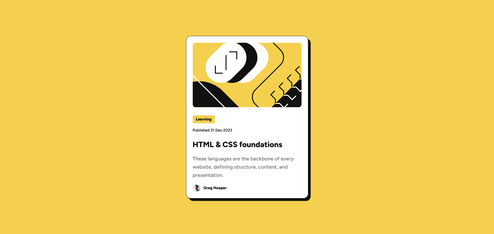
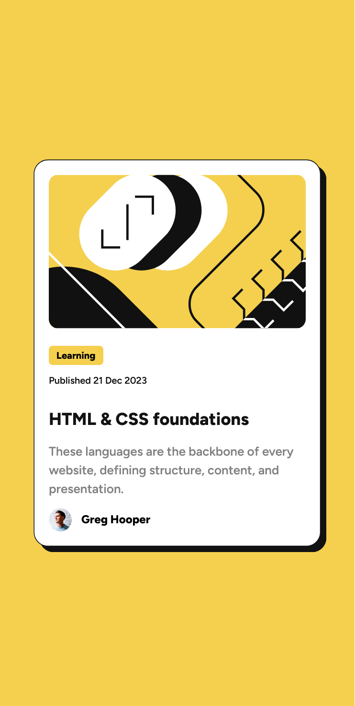

# Blog Preview Card

## Table of contents

- [Overview](#overview)
  - [The challenge](#the-challenge)
  - [Screenshot](#screenshot)
  - [Links](#links)
- [My process](#my-process)
  - [Built with](#built-with)
  - [What I learned](#what-i-learned)
  - [Continued development](#continued-development)
- [Author](#author)

## Overview

### The challenge

Users should be able to:

- See hover and focus states for all interactive elements on the page
- View the optimal layout for the card on different screen sizes (mobile and desktop)

### Screenshot



<!--  -->

### Links

- [Live Site URL](https://nizarlubbad.github.io/blog-preview-card/)

## My process

### Built with

- Semantic HTML5 markup
- CSS custom properties
- Flexbox
- Responsive design
- Google Fonts (Figtree)

### What I learned

This project helped me reinforce my understanding of:

1. **Flexbox Centering**: Using flexbox to perfectly center content vertically and horizontally without causing scrollbars:

```css
body {
  min-height: 100vh;
  display: flex;
  justify-content: center;
  align-items: center;
}
```

1. **Responsive Design**: Implementing media queries for mobile-first approach targeting the 375px breakpoint:

```css
@media (max-width: 375px) {
  .card {
    padding: 1.2rem;
    gap: 1rem;
  }
}
```

3. **CSS Transitions**: Creating smooth hover effects for better user experience:

```css
.card {
  transition: box-shadow 0.3s ease-in;
}

.card:hover {
  box-shadow: 1.2rem 1.2rem hsl(0, 0%, 7%);
}
```

4. **Accessibility**: Using semantic HTML elements and proper ARIA labels for better accessibility.

### Continued development

Areas I want to focus on in future projects:

<!-- - Implementing CSS Grid for more complex layouts -->

- Adding JavaScript interactions for enhanced functionality
- Exploring CSS animations beyond transitions
- Improving accessibility with WCAG guidelines
- Using CSS custom properties (variables) more effectively

## Author

- Frontend Mentor - [@nizarLubbad](https://www.frontendmentor.io/profile/nizarLubbad)
- GitHub - [@nizarLubbad](https://github.com/nizarLubbad)
